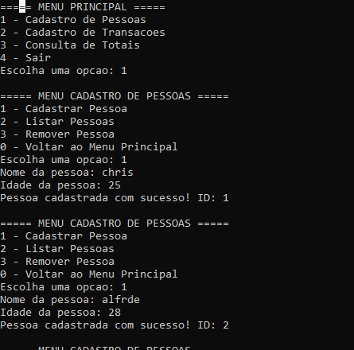

# Domentação do Sistema de Controle de Gastos Residenciais

### Descrição do Sistema

O Sistema de Controle de Gastos Residenciais é um aplicativo desenvolvido em **C** utilizando **listas simplesmente encadeadas** e **TADs** para armazenar e organizar as informações. O Tipo Abstrato de Dados **(TAD)** é uma maneira de organizar e manipular dados, definindo a estrutura de dados e as operações que podem ser realizadas sobre eles, sem expor a implementação interna. No sistema, utilizamos **TADs** para representar pessoas e transações, permitindo que as operações sejam realizadas de forma encapsulada.

## Estrutura de Dados
O sistema utiliza uma estrutura (struct) que contém informações sobre cada pessoa, incluindo seu nome, idade e uma lista de transações (receitas e despesas). Cada transação também é armazenada em uma lista encadeada, permitindo o registro de múltiplas transações para cada pessoa.

A estrutura básica do menu é a seguinte:

Opção 1: ``Cadastrar Pessoa``

Opção 2: ``Cadastrar Transação``

Opção 3: ``Listar Transações``

Opção 4: ``Sair``

Ao selecionar uma opção, o programa utiliza uma estrutura ``switch`` para direcionar o fluxo de execução para a função correspondente. Cada opção do menu chama uma função específica que realiza a operação desejada.

**Menus Secundários**

Após escolher certas opções no menu principal, o usuário pode ser redirecionado para menus adicionais, como:

``Menu de cadastro pessoa :`` permite cadastrar informaçeos de uma pessoa.

``Menu de Cadastro de Transações :`` Permite cadastrar transações e escolher entre Receita ou Despesa.
Caso o usuário seja menor de idade, apenas despesas são aceitas.

``Menu de Consulta totais :`` Exibe totais de receitas e despesas.

Lógica do switch
O usuário digita um número correspondente à operação que deseja realizar.
O switch avalia o número digitado e executa a função associada àquele número.
Caso o usuário escolha a opção 4 (sair), o sistema redireciona para finaliza a execução.

**Funções Implementadas**

``cadastrar_pessoa():`` Cadastra uma nova pessoa no sistema.

``cadastrar_transacao():`` Permite ao usuário registrar uma nova receita ou despesa.

``listar_transacoes():`` Exibe todas as transações cadastradas, filtradas por ID de pessoa, se necessário.

``consultar_totais():`` Calcula e exibe o total de receitas e despesas.

``deletar_Pessoa():`` Permite excluir uma uma pessoa e suas transações informando o ID.

Essa estrutura proporciona uma navegação intuitiva e clara, permitindo que o usuário utilize o sistema de forma eficiente. Os comentários no código ajudam a entender a lógica de cada função e o propósito de cada parte do menu.

#### ``!!!lembrando nos menus secondarios opção 0 leva para o Menu principal``

   ## Como Usar
   **Instruções para Baixar e Executar o Sistema de Controle de Gastos Residenciais**

   
   ``1.Baixar o Arquivo``

Acesse o repositório do GitHub.

Clique no botão "Code" e selecione "Download ZIP" para baixar o projeto como um arquivo ZIP

``2.Compactar o Arquivo``

Depois de baixar o arquivo ZIP, você pode precisar compactá-lo para transferi-lo ou armazená-lo. Para compactar o arquivo em diferentes sistemas operacionais, siga as instruções abaixo:

``3.Executar o Sistema``

**Windows:**

Navegue até a pasta \Sistem_Gastos\bin\Debug usando o Explorer.
Dê um duplo clique em ``Sistem_gastos.exe`` para executar o programa.

**Linux:**

Abra o terminal e vá até a pasta do sistema:

cd /caminho/para/Sistem_Gastos/bin/Debug
Execute o arquivo: ``Sistem_gastos.exe``

